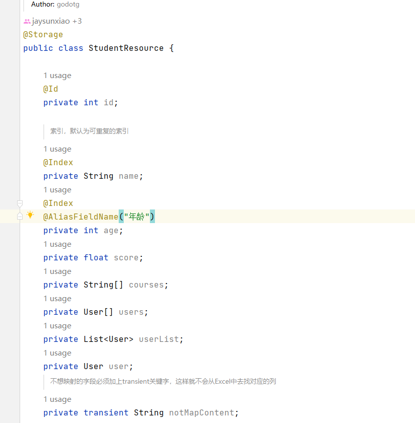

English | [简体中文](./README_CN.md)

### Ⅰ. Introduction

- [storage](https://github.com/zfoo-project/zfoo/blob/main/storage/README.md)
  Java pojo and excel/csv/json automatic mapping framework, only need to define a class corresponding to Excel, directly parse
  Excel, json, csv

- Take advantage of the reflection nature of the Java dynamic language to parse Excel without any code

- Support Excel to export json, csv files

### Ⅱ. Automatic mapping

- The first line of Excel corresponds to the Java class attribute, and the second and third lines do not serve as
  comments, where the first column must be the Id attribute


- The Java class for Excel



- After parsing, there are two ways to use it
  1. By annotation
  ```
   @Component
   public class StudentManager {

    @ResInjection
    private Storage<Integer, StudentResource> studentResources;

    }
  ```
  2. Dynamically obtained through classes
  ```
  Storage<Integer, StudentResource> studentResources = (Storage<Integer, StudentResource>) StorageContext.getStorageManager().getStorage(StudentResource.class);
  ```

- Find the corresponding row by id

```
var studentResource = studentResources.get(1000);
```

- Find the corresponding row by index, default to a repeatable index, and return a list

```
var students = studentResources.getIndex("name", "james0");
```

- The unique index is obtained through Storage.getUniqueIndex(), and the index annotation needs to be marked as @Index(
  unique = true)

### Ⅲ. Hot update Excel Json

- [tank](https://github.com/zfoo-project/tank-game-server/blob/main/common/src/main/java/com/zfoo/tank/common/util/HotUtils.java)
  Distributed hot update Excel Jsoncsv configuration file implementation

### Ⅳ. Use

- Financial analysis, data analysis statistics
- Numerical configuration in the game
